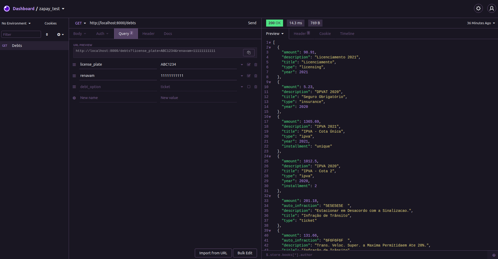
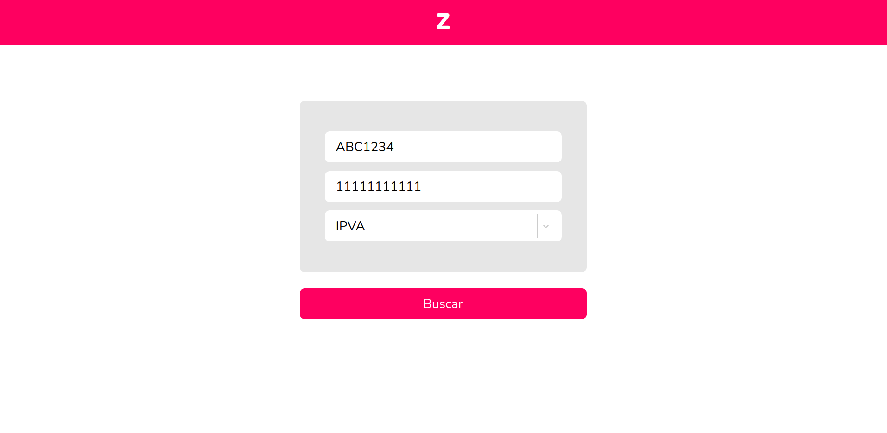
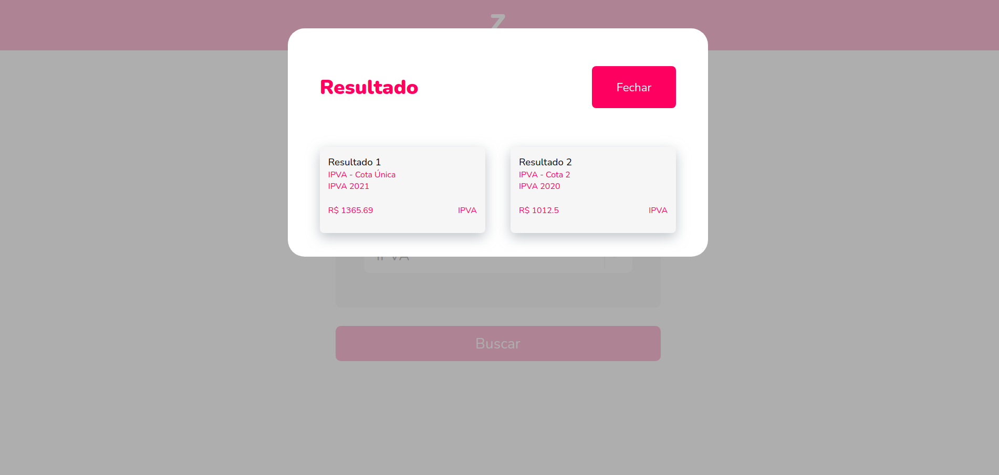

# Zapay API Test

API Django backend e React frontend desenvolvida no Processo Seletivo da Zapay.


#

## Instruções para execução

### Passo 1: Clonar o repositório

```
git clone https://github.com/viniciussaturnino/zapay-test
```

### Passo 2: Rodar o backend

Na pasta zapay:
```
docker-compose up
```

### Passo 3: Rodar o frontend
Na pasta frontend:
```
yarn
```
```
yarn start
```

#

# Print de requisição no Insomnia

## Requisição com busca geral de débitos:
<div align="center">
    
</div>

# Prints da aplicação frontend

## Home:
<div align="center">
    
</div>

## Search:
<div align="center">
    
</div>

#

## Atividades

- [x] **Atividade 1:** Repare que a classe SPService recebe um parâmetro chamado “debt_option”, que
pode ser “ticket”, “ipva” ou “dpvat”. Na prática, isto significa que o usuário precisa
fazer uma pesquisa para cada tipo de débito que quer pagar - e se ele quer pagar
todos os débitos de seu veículo, precisará fazer três pesquisas! Não seria melhor se
ele pudesse fazer tudo de uma vez? Para isso, atualize a implementação do
SPService e do SPParser (bem como quaisquer modificações no arquivo main.py que
julgar necessárias) de modo que haja um jeito de retornar todos os débitos. Mas
lembre-se, o envio do parâmetro “debt_option” deve continuar funcionando, mesmo
que ele passe a ser não obrigatório!
- [x] **Atividade 2:** A API possui ainda um outro tipo de débito, ainda não implementado, chamado
Licenciamento. Trata-se do pagamento da taxa de licenciamento do veículo, muito
requisitado pelos clientes. Você pode consultá-lo no arquivo api.py. Seu formato é um
pouco diferente dos demais. Implemente um parser para ele, de modo que retorne as
chaves “amount”, “title”, “description”, “year" e “type”. Seu “debt_option” e seu “type"
devem ser “licensing”.
- [x] **Atividade 3:** Um problema começou a ocorrer com a chegada das novas placas do Mercosul: a API
de São Paulo não havia se atualizado ainda para o formato novo, e apenas
compreendia a versão antiga daquela placa. Assim, um usuário que fizesse uma
pesquisa com a placa ABC1C34 receberia a mensagem “Veículo não encontrado”,
simplesmente porque a API não era capaz de converter esta informação para
ABC1234. Implemente um método no service que faça esta conversão pela API, para
que os clientes com placas atualizadas possam pesquisar seus débitos. Você pode
testar usa implementação pesquisando com a placa ABC1C34.
- [x] **Atividade 4:** Faça testes! Não precisa testar todos os métodos, apenas dois ou três já bastam.
Caso queira fazer mais testes do que isso, no intuito de mostrar seus conhecimentos,
tanto melhor.
- [x] **Atividade 5 (bônus):**  use mocks! Quando estamos testando o SPService, que está muito atrelado
à API, o ideal é que não façamos testes que de fato acessam esta API. Isto pode
gerar vários problemas, como testes falhando aleatoriamente em caso de
indisponibilidade, ou valores imprevisíveis. Ao invés disso, podemos mockar os
resultados da API. Caso queira fazer testes com mocks, utilize a tecnologia de sua
preferência.
- [x] **Atividade 6 (bônus):**  transforme esse script numa api simples, pode utilizar Flask, FastAPI ou algum
outro framework de sua preferência, você só precisa demonstrar sua familiaridade com a
ferramenta. Deve conter somente 1 endpoint que retorne a busca dos débitos, você é livre
para escolher o verbo http, não existe resposta certa somente a escolha mais adequada
na sua visão, mesma coisa para o formato de recebimento das informações organize
como preferir
- [x] **Atividade 7 (bônus):** crie um Dockerfile para rodar sua mais nova API! Ele não precisa ter nada
além disso, somente conseguir rodar seu mais novo sistema!
- [x] **Atividade 8 (bônus):**  sabe trabalhar com ReactJS e quer mostrar para a gente? Maravilha!
Implemente um frontend simples que se alimente das informações geradas pelo
SPParser. Não precisa fazer uma API se não quiser: contanto que o formato dos
dados usados no frontend seja o mesmo, não faz mal se estiverem “hardcoded".